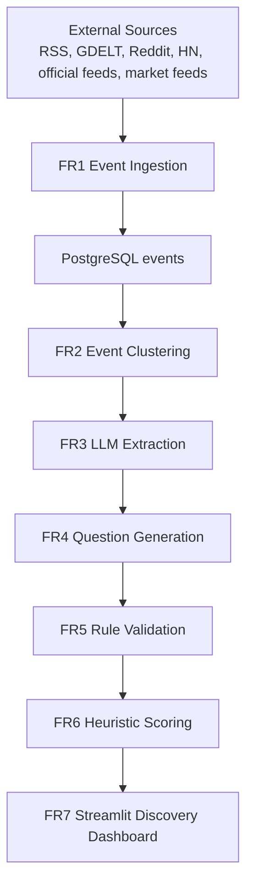

# Prediction Market Discovery (Tony Version)

## Overview

This project is a staged prediction-market pipeline backed by PostgreSQL. It ingests real-world events, clusters related stories, extracts structured event specs with an LLM, generates candidate prediction-market questions, validates them, scores them, and surfaces them in a Streamlit dashboard.

The Tony version keeps the original FR1-FR6 pipeline structure, but changes the product framing of the Streamlit app. Instead of centering an internal review/admin queue, the dashboard is now positioned as a consumer-facing discovery experience for active markets and emerging topics.

## Tony Version vs. Jack Version

Compared with the earlier Jack version, this version differs in a few clear ways:

- The Streamlit app is now titled `Prediction Market Discovery`.
- The UI emphasizes `Emerging Topics`, `Active Markets`, trend signals, and category exploration.
- Market questions are rendered as consumer-facing cards rather than review-first admin tables.
- Sidebar controls focus on discovery filters such as search, category, question type, minimum score, status, and sort order.
- Admin-oriented controls are no longer the main focus and are moved into collapsed tools.
- The app includes graceful demo fallback when the database is empty or temporarily unavailable.
- This local setup has been configured and tested with PostgreSQL plus Gemini.

In short: Jack's version was closer to an internal market-candidate review tool, while Tony's version is closer to a Polymarket/Kalshi-style discovery page layered on top of the same pipeline.

## Architecture Summary

The system is organized as a staged pipeline:



Code entry points:

- `pipeline.py`
- `db/connection.py`
- `streamlit_app.py`

## Stage Responsibilities

- `FR1` ingests raw events from public, official, social, and market data sources.
- `FR2` embeds event text, removes near-duplicates, and clusters related events.
- `FR3` uses an LLM to convert a cluster into a structured `ExtractedEvent`.
- `FR4` uses an LLM to generate market questions from extracted events.
- `FR5` validates generated questions with deterministic rules.
- `FR6` scores validated questions using heuristic scoring components.
- `FR7` displays the results in a Streamlit discovery dashboard.

## Project Structure

```text
prediction-market-capstone-tony-final/
|-- README.md
|-- requirements.txt
|-- .env.example
|-- config.py
|-- pipeline.py
|-- streamlit_app.py
|-- models.py
|-- db/
|   |-- schema.sql
|   `-- connection.py
|-- ingestion/
|-- clustering/
|-- extraction/
|-- generation/
|-- validation/
|-- scoring/
|-- ranking/
|-- tests/
`-- sample_outputs/
```

## Setup

### Prerequisites

- Windows
- Python 3.10+
- PostgreSQL running locally
- A database named `prediction_markets`
- A Gemini or Groq API key for FR3 and FR4

To create the database manually:

```powershell
psql -U postgres -c "CREATE DATABASE prediction_markets;"
```

### Installation

```powershell
python -m venv .venv
.venv\Scripts\activate
python -m pip install --upgrade pip
pip install -r requirements.txt
copy .env.example .env
```

Update `.env` with at least:

```env
DB_HOST=localhost
DB_PORT=5432
DB_NAME=prediction_markets
DB_USER=postgres
DB_PASSWORD=your_postgres_password

LLM_PROVIDER=gemini
LLM_API_KEY=your_api_key
LLM_MODEL=gemini-3-flash-preview
FR3_LLM_MODEL=gemini-3-flash-preview
FR4_LLM_MODEL=gemini-3-flash-preview
```

Notes:

- The schema is created automatically when `pipeline.py` runs.
- FR2 downloads the `all-MiniLM-L6-v2` embedding model on first use.
- Some FR1 sources are skipped gracefully if optional API keys are missing.

## Running the Pipeline

Run the full pipeline:

```powershell
python pipeline.py
```

Useful variants:

```powershell
python pipeline.py --stage 1-2
python pipeline.py --stage 3-6
python pipeline.py --stage 4-6 --fr4-limit 5
python pipeline.py --stage 3-6 --fr3-limit 10 --fr4-limit 5
```

Important flags:

- `--stage`
- `--fr3-limit`
- `--fr4-limit`
- `--fr3-all`
- `--fr4-all`
- `--fr3-model`
- `--fr4-model`
- `--debug`
- `--log-mode debug`

## Running the Dashboard

```powershell
python -m streamlit run streamlit_app.py
```

The Tony dashboard includes:

- top-level hero metrics
- `Emerging Topics`
- `Active Markets`
- consumer-friendly market cards
- topic cards with trend scores
- category exploration
- saved items via Streamlit session state
- graceful demo fallback
- collapsed admin tools

## Current Status

At the time of this version:

- PostgreSQL local setup is working
- Gemini-based FR3/FR4 runs are working
- The dashboard has been refactored into a discovery-oriented UI
- Real pipeline outputs can now populate the dashboard instead of demo data

## Known Limitations

- Some FR1 sources may time out or be skipped if optional API keys are not configured.
- The project still uses `google.generativeai`, which now shows a deprecation warning.
- Python 3.10 still works, but moving to Python 3.11 would be safer long term.
- Some generated questions still fail deterministic validation, which is expected.
- Hugging Face model downloads on Windows may show cache/symlink warnings.

## Summary

This Tony version is best understood as:

- the same pipeline foundation as the original capstone
- a different Streamlit product direction
- better local-demo resilience
- a more consumer-facing discovery experience

