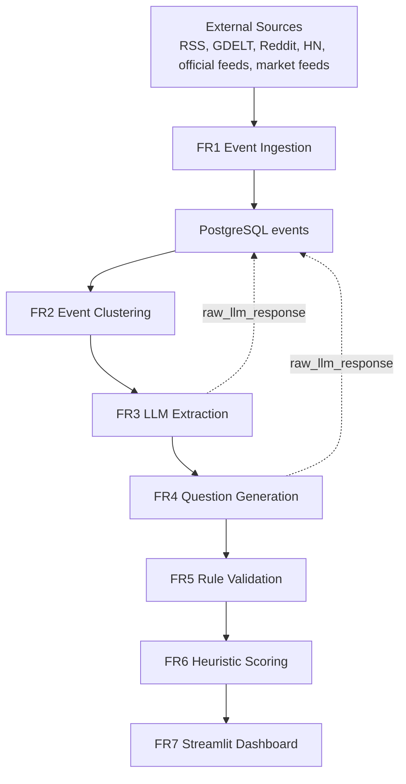

# Prediction Market Generator

## Project Overview

This project is a modular pipeline for discovering real-world events, extracting market-ready signals, generating candidate prediction-market questions, validating them, scoring them, and reviewing them in Streamlit. The core goal is to help prediction-market operators move from raw information to clean, reviewable market drafts faster, while keeping a human in the loop for ambiguity, compliance, and editorial judgment.

The system was built as a capstone around a practical workflow identified in the project materials: operators currently scan news manually, translate narratives into contracts under time pressure, and then sort through unclear or weakly resolvable questions. To address that, the repository is organized as a sequence of small, testable stages so parts of the pipeline can be rerun independently during debugging or demos without reprocessing everything from scratch.

## Architecture Summary

The architecture is a staged batch pipeline backed by PostgreSQL. Raw events are ingested and clustered first, then LLM stages convert them into structured event representations and candidate questions. Deterministic validation and scoring happen after generation so the final dashboard reflects both model output and rule-based quality control.



For a code-level view of the architecture, start with `pipeline.py`, `db/connection.py`, and `streamlit_app.py`.

### Stage responsibilities

- `FR1` ingests raw events from news, official sources, social/attention sources, and benchmark market feeds.
- `FR2` embeds event text, removes near-duplicates, and clusters semantically similar events.
- `FR3` uses an LLM to convert a cluster into a structured `ExtractedEvent`.
- `FR4` uses an LLM to generate market questions, then applies dedupe and product-shape filters.
- `FR5` applies deterministic validation rules to catch weak wording, weak resolution plans, stale deadlines, and similar issues.
- `FR6` scores validated questions using cluster strength, clarity, novelty, market interest, and resolution quality.
- `FR7` exposes the resulting queue in Streamlit, including review actions and a background pipeline runner.

## Why The Project Is Structured This Way

The repository is intentionally split by stage and by shared concerns:

- stage-specific logic lives in folders like `ingestion/`, `clustering/`, `extraction/`, `generation/`, `validation/`, and `scoring/`
- shared data contracts live in `models.py`
- database helpers live in `db/connection.py`
- cross-stage ranking and dedupe logic lives in the `ranking/` helper package

This keeps the pipeline easy to reason about:

- you can rerun `FR4-FR6` without re-ingesting or reclustering
- you can test validation and scoring independently from the LLM stages
- Streamlit reads from the same PostgreSQL state that the pipeline writes to

## Project Structure

```text
prediction-market-capstone/
|-- README.md                # Project overview, architecture, and run instructions
|-- requirements.txt         # Python dependencies
|-- .env.example             # Example environment-variable configuration
|-- config.py                 # Environment-backed configuration
|-- pipeline.py               # Pipeline entrypoint and stage orchestration
|-- pipeline.log              # Runtime log for terminal and background runs
|-- streamlit_app.py          # FR7 dashboard and background runner
|-- models.py                 # Shared data models used across all stages
|-- archive/                  # Legacy/demo artifacts kept out of the main flow
|-- ranking/                  # Cross-stage ranking, popularity, and dedupe helpers
|-- db/
|   |-- schema.sql            # PostgreSQL schema and lightweight migrations
|   `-- connection.py         # Database access helpers for every stage
|-- ingestion/                # FR1 source connectors
|-- clustering/               # FR2 embeddings, clustering, cluster features
|-- extraction/               # FR3 LLM extraction client, prompts, schema
|-- generation/               # FR4 generation client, prompts, schema, repair logic
|-- validation/               # FR5 deterministic validation rules
|-- scoring/                  # FR6 scoring heuristics
|-- tests/                    # Unit tests for pipeline, dashboard, validation, etc.
|-- sample_outputs/           # Example pipeline outputs captured during development
`-- backups/                  # Local backups created during DB cleanup/debugging
```

## Setup And Execution

### Prerequisites

- **OS:** Windows (macOS and Linux are not officially supported by this setup guide)
- **Python 3.10+** — download from [python.org](https://www.python.org/downloads/)
- **PostgreSQL 13+** — running locally with a database named `prediction_markets` created before first run
  ```powershell
  psql -U postgres -c "CREATE DATABASE prediction_markets;"
  ```
- **LLM API key** — a Groq API key is required to run FR3 and FR4 (free tier available at [console.groq.com](https://console.groq.com)); a Gemini key is optional
- **Optional API keys** — the following sources are skipped gracefully if their keys are absent; FR1 still runs with RSS, GDELT, Hacker News, Wikipedia, SEC EDGAR, Polymarket, and Kalshi without them:
  - `REDDIT_CLIENT_ID` / `REDDIT_CLIENT_SECRET` — [reddit.com/prefs/apps](https://www.reddit.com/prefs/apps)
  - `BLS_API_KEY` — [bls.gov/developers](https://www.bls.gov/developers/)
  - `FRED_API_KEY` — [fred.stlouisfed.org/docs/api/api_key.html](https://fred.stlouisfed.org/docs/api/api_key.html)
  - `EIA_API_KEY` — [eia.gov/opendata](https://www.eia.gov/opendata/)
  - `CONGRESS_API_KEY` — [api.congress.gov](https://api.congress.gov/)

### Installation

```powershell
python -m venv .venv
.venv\Scripts\activate
python -m pip install --upgrade pip
pip install -r requirements.txt
copy .env.example .env
```

Update `.env` with at minimum:

```
DB_NAME=prediction_markets
DB_USER=postgres
DB_PASSWORD=your_postgres_password
LLM_API_KEY=gsk_...
```

Full list of available settings is documented in `.env.example`. The database schema (all tables) is created automatically the first time `pipeline.py` runs — no manual SQL step is needed beyond creating the database itself.

> **Note:** FR2 downloads the `all-MiniLM-L6-v2` embedding model (~90 MB) from Hugging Face on first run. Ensure you have an internet connection when running FR2 for the first time.

### Execute the pipeline

```powershell
python pipeline.py
python pipeline.py --stage 1-2
python pipeline.py --stage 3-6
python pipeline.py --stage 4-6 --fr4-limit 5
python pipeline.py --stage 3-6 --fr3-limit 10 --fr4-limit 5
```

Useful flags:

- `--stage 4-6` reruns question generation, validation, and scoring only
- `--fr3-limit` caps how many clusters FR3 extracts in one run
- `--fr4-limit` caps how many extracted events FR4 generates for in one run
- `--fr3-all` / `--fr4-all` ignore those caps
- `--fr3-model` / `--fr4-model` override stage-specific LLM models
- `--debug` or `--log-mode debug` enables more detailed console/file logging

### Run the dashboard

```powershell
python -m streamlit run streamlit_app.py
```

The dashboard provides:

- scored question review
- selected / removed / expired queues
- failed-but-salvageable "Needs Repair" questions
- a background "Market Generator" runner for FR1-FR6

## Implemented Features Vs. Planned Features

### Implemented features

The current repository implements the full MVP workflow described in the capstone materials:

- `FR1` event ingestion from multiple public and official sources
- `FR2` embedding-based clustering with cluster feature computation
- `FR3` structured LLM extraction with schema enforcement
- `FR4` question generation, repair, dedupe, and product-shape filtering
- `FR5` deterministic validation for ambiguity, source quality, deadlines, and structure
- `FR6` heuristic scoring and ranking
- `FR7` Streamlit review interface with review-state persistence and a background pipeline runner

The current code also includes practical debugging and product-quality additions beyond the bare stage definitions:

- stage-specific LLM models for FR3 and FR4
- FR3 and FR4 run caps for debugging and quota control
- popularity bias before expensive LLM stages
- story-level dedupe and question-level dedupe
- dashboard review queues for `Active`, `Selected`, `Removed`, `Expired`, and `Needs Repair`

### Planned features / future work

Based on the attached capstone documents, the broader direction after the MVP is less about adding brand-new stages and more about hardening the system around the existing workflow. The main future work areas are:

- stronger runtime optimization toward the target end-to-end batch latency described in the requirements
- richer human-in-the-loop editing, approval, and audit support for listing teams
- better resilience and fallback behavior around external API failures and LLM latency
- stronger prioritization and demand-estimation signals for deciding which candidate markets are worth listing first
- production hardening around interpretability, monitoring, and operational reliability

## Known Limitations And Technical Debt

- Terminal runs that are started without a dashboard `run_id` still execute normally, but they do not appear in the Streamlit run-history tables.
- LLM-heavy stages are constrained by provider rate limits, context limits, and occasional schema-invalid responses.
- Geopolitics and breaking-news questions remain harder to resolve cleanly than elections, finance filings, sports standings, or formal macro releases.
- The pipeline currently relies on heuristic popularity ranking and heuristic dedupe rather than a fully learned ranking model.
- PostgreSQL is treated as the system of record for both pipeline artifacts and dashboard review state, which is convenient for demos but still a coupling point.
- Some source-selection and repair behavior is intentionally conservative; that protects quality, but it can also leave potentially interesting questions in the repair queue instead of the main scored queue.

## Logging And Run State

There are three main places to inspect behavior:

- `pipeline.log`
  - persistent file log for terminal and background runs
- PostgreSQL tables `pipeline_runs` and `pipeline_run_stages`
  - run status, stage summaries, active background progress
- PostgreSQL columns `raw_llm_response`
  - stored on `extracted_events` and `candidate_questions` for FR3/FR4 debugging

## External Libraries And APIs

### Python libraries

- `feedparser`
  - parses RSS and Atom feeds used in FR1
- `requests`
  - HTTP client for external feeds and APIs
- `beautifulsoup4`
  - lightweight HTML parsing for source-specific ingestion cleanup
- `sentence-transformers`
  - creates semantic embeddings for FR2
- `scikit-learn`
  - provides DBSCAN clustering for FR2
- `numpy`
  - vector and numerical utilities used around clustering/scoring
- `psycopg2-binary`
  - PostgreSQL access layer
- `groq`
  - client SDK for Groq-hosted LLM calls
- `google-generativeai`
  - optional Gemini client integration
- `jsonschema`
  - schema validation for structured LLM outputs
- `python-dotenv`
  - loads `.env` configuration
- `streamlit`
  - FR7 review dashboard and pipeline launcher
- `pytest`
  - automated test suite

### External data sources and APIs

The project currently draws from a mix of feed-based, public-web, and official-source inputs, including:

- RSS feeds from major publishers
- GDELT
- Reddit
- Hacker News
- Wikipedia pageview/trending signals
- Federal Register
- Congress
- SEC EDGAR
- BLS / FRED / EIA
- Polymarket
- Kalshi

### LLM APIs

Stage-specific model routing is supported:

- `FR3` can use one model for extraction
- `FR4` can use another model for generation/repair

The main LLM provider integrations currently implemented in the codebase are:

- `Groq`
  - used for OpenAI-compatible chat completion calls to models hosted through Groq
- `Google Gemini`
  - optional Gemini integration for the same FR3/FR4 structured-generation workflow

## Testing

Run the full suite with:

```powershell
python -m pytest tests -q
```

The repository includes tests for:

- clustering and feature logic
- FR3/FR4 model wiring and schema handling
- validation and scoring rules
- story dedupe and popularity bias
- dashboard state, review actions, and runner controls

## Notes On Architectural Intent

Some behavior is intentionally opinionated:

- FR3 and FR4 are capped by default so debugging does not consume unlimited time or tokens
- FR4 dedupes extracted events before generation because the same news story can appear through multiple upstream clusters
- FR5 uses category-aware source validation so geopolitics/news questions are not judged by the same standard as SEC filings or elections
- Streamlit review state is stored in PostgreSQL rather than session state so selections persist across reruns and demos

## Team Member Responsibilities

| Area | Initial | Iteration 2 | Iteration 3 |
|---|---|---|---|
| FR1–FR3 (Ingestion, Clustering, Extraction) | Zixu Li | Jack Jia | Zixu Li |
| FR4 (Question Generation) | Jack Jia | Zixu Li | Jack Jia |
| FR5–FR7 (Validation, Scoring, Dashboard) | Jia Herng Yap | | |
| Final Integration | Jack Jia | Zixu Li | Jia Herng Yap |
| Execution Testing | Jia Herng Yap | | |
